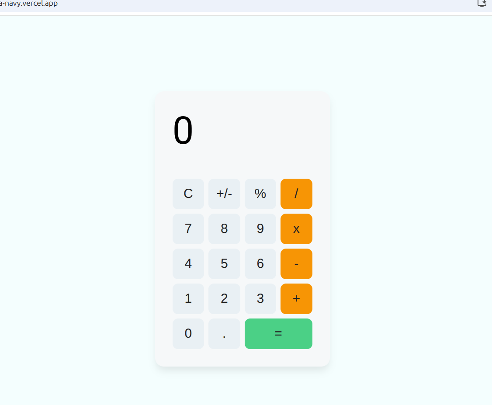

# 🧮 React Calculator – Enhanced Version

## 🔹 Original Project Functionality
This project started as a **basic React calculator** with:  
- Standard arithmetic operations (+, −, ×, ÷, %).  
- Simple user interface with number and operator buttons.  
- Real-time display of entered input and results.  

---

## 🔹 Added Features

### 1. Scientific Functions  
- Added advanced operations: √ (square root), x² (power), sin, cos, tan  
- Implemented using JavaScript `Math` functions.  
- Results display correctly with decimals.  

📸 Example:  

---

### 2. Calculation History  
- Keeps track of past operations and results.  
- Displays a list of previous calculations under the main calculator.  
- Includes a **Clear History** button to reset the list.  

📸 Example:  

---

### 3. Error Handling  
- Prevents division by zero (shows **Error**).  
- Enforces a maximum digit limit (12 digits).  
- Invalid operations no longer break the app.  

📸 Example:  

---
### 4. UI/UX Improvements  
- Improved overall calculator design with modern styling.  
- Added consistent button sizes and spacing for better usability.  
- Enhanced color scheme for better contrast and readability.  
- Responsive layout that adapts to different screen sizes.  

📸 Example:  
New Calculator 

Original Calculator  

## 🔹 Implementation Process
- Used **Aider AI** to iteratively add new features.  
- Commands used: `/add`, `/ask`, `/edit`, `/diff`, `/commit`, `/run`, `/test`, `/undo`.  
- Refined changes step by step with careful review.  
- Manual testing confirmed all features working as expected.  

---

## 🔹 Challenges & Solutions
- **Dependency conflict** with `react-textfit`: fixed by using `--legacy-peer-deps`.  
- **Floating-point precision**: rounded results to 6 decimal places.  
- **Division by zero**: handled gracefully with error messages.  

---

## 🔹 Conclusion
This project is now a **feature-rich scientific calculator** with:  
- Advanced mathematical functions  
- A clear calculation history  
- Strong error handling  

It demonstrates how **Aider AI** can speed up development, provide iterative improvements, and help implement meaningful new features in a short time.  

---
